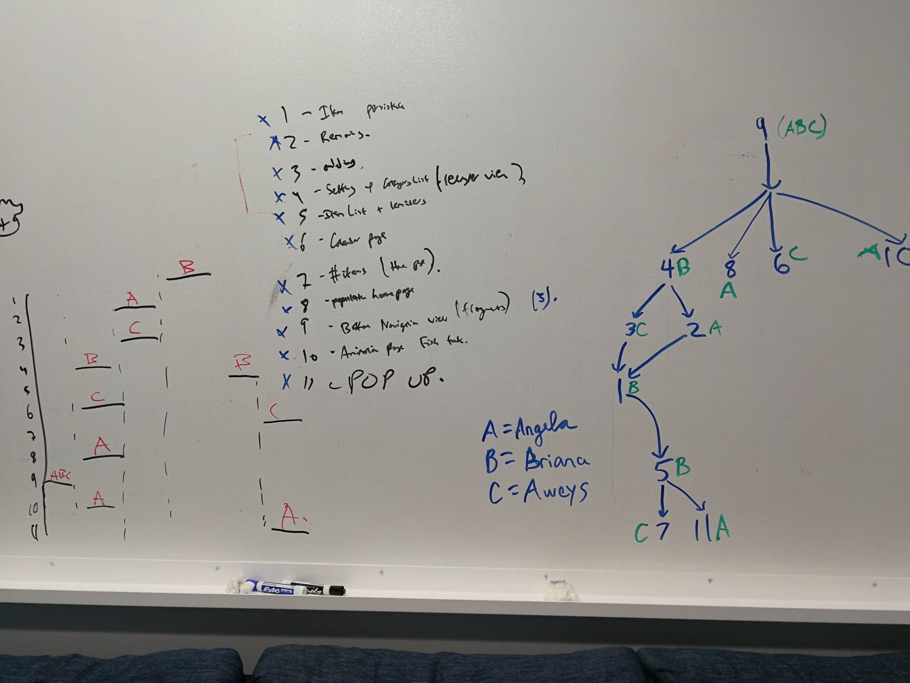

# Waves
Waves has two goals to incentivize productivity to everyone for free and help end plastic pollution in our oceans by providing resources to nonprofit cleanups for free.

# Stick to MVP
- Your North Star is your working MVP. Every additional feature: Q: is it part of MVP?
- Get to iteration and market testing asap
- scope creep 

# The Plan
ABC (all of us) = Bottom Navigation Bar (setup)

A = Angela
- populate home page
- animate fish tank page
- remove item
- pop-up

B = Briana
- Setting up category list using recycler view
- item persistance
- item list and reminders (connected to calendar)

C = Aweys
- Calendar
- Adding item
- Number of items

# List of Potential Stretch Goals: 
- Tap for adding
- Gesture movement instead of navigation bar based
- Sharing to some sort of messaging app (e.g. email, messages, etc)
